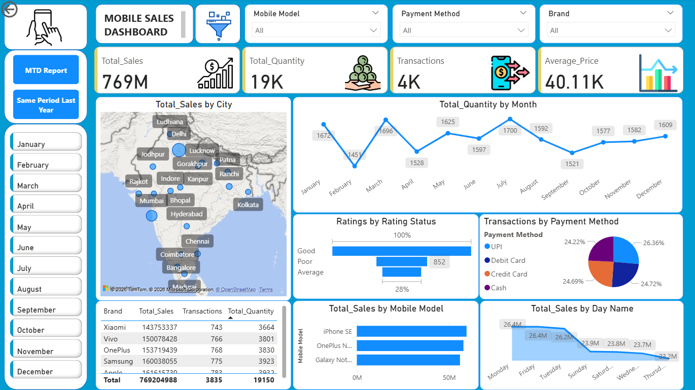
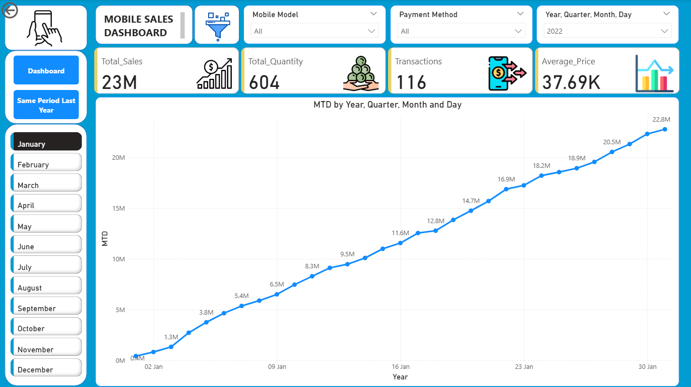
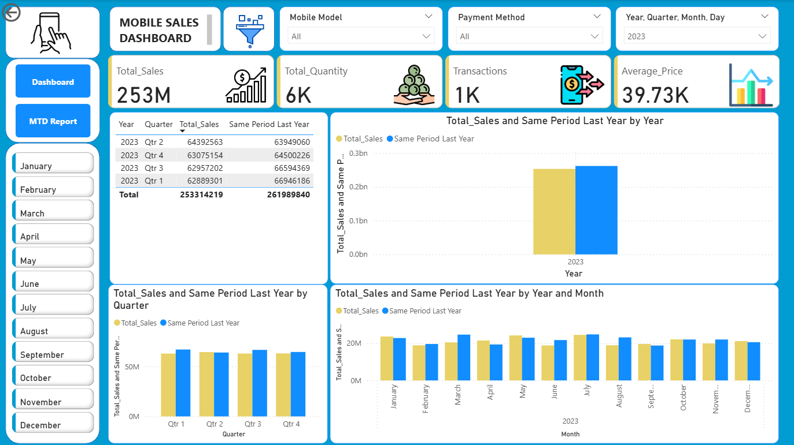

# Mobile Sales Analytics Dashboard

## Objective
To analyze mobile sales data and deliver insights through an interactive Power BI dashboard to support business decisions.

## Project Overview
This project focuses on analyzing mobile sales performance using Power BI.  
The dashboard provides a clear view of sales trends, product performance, regional insights, and customer behavior to enable data-driven decision-making.

## Key Features
- Interactive dashboard to track total sales, quantity sold, transactions, and average price
- Month-to-Date (MTD) and Same Period Last Year (SPLY) analysis for performance comparison
- Customer rating classification (Good / Average / Poor) to assess satisfaction levels
- Insights across time, city, brand, model, and payment methods

## DAX Measures Used
- Total_Sales  
- Total_Quantity  
- Transactions  
- Average_Price  
- Month-to-Date (MTD)  
- Same Period Last Year
- Rating Status (Good / Average / Poor)

## Data Modeling
- Created a Custom Calendar (Date dimension)
- Established proper relationships between fact and date tables
- Enabled time intelligence analysis for accurate trends and comparisons

## Business Impact
- Helped identify high-performing periods, products, and regions
- Improved visibility into sales trends and customer preferences
- Supported better planning, monitoring, and strategic decisions

## Tools & Technologies
- Power BI  
- DAX  
- Data Modeling  
- Sales & Business Analytics

## Dashboard Preview

### Overall Sales Performance

### Sales Trend & Time Analysis

### Product, Region & Payment Insights

## Contact  
**Email:** ishantkatiyar68@gmail.com  
**LinkedIn:** https://www.linkedin.com/in/ishantkatiyar/
